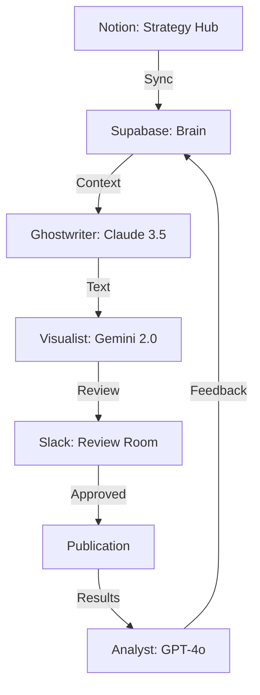

# ICOS Strategic Review: The "Higher Look"

The **Infinity Content OS (ICOS)** is not just an automation tool; it is a **Decentralized Intelligence Engine** designed to scale Wadi Bardawil’s personal brand through autonomous agents, structured feedback loops, and a high-fidelity RAG system.

## 🎯 Core Objectives
1.  **Personal Brand Power**: Position Wadi as a thought leader to drive appointments, speaking gigs, and job offers.
2.  **Autonomous Lifecycle**: Manage the full cycle from raw research to scheduled posting (3x daily).
3.  **High-Fidelity Voice**: Permanent "Justin Welsh" style alignment via RAG and feedback loops.
4.  **Self-Optimizing System**: Use performance audits to continuously refine "impact" and conversion.

---

## 🎭 The 5 Primary Scenarios

### 0. The Research Engine (New)
*   **Trigger**: Daily web scraping or newsletter intake.
*   **Logic**: Fetch top trends/news → Filter by Wadi's topics → Save to Notion "Ideas" database.
*   **Outcome**: A constant stream of fresh, relevant ideas.

### 1. The 3x Daily Post Engine
*   **Trigger**: Scheduled (Morning, Noon, Evening).
*   **Logic**: Select top-weighted Idea → Generate Post + Visual → Slack Review.
*   **Outcome**: High-frequency visibility with zero manual effort.

### 2. The "Idea-to-Draft" Flow (User-Initiated)
*   **Trigger**: Notion Status Change (e.g., "Idea" → "Generate").
*   **Logic**: Native Notion node detects change → Immediate drafting.
*   **Outcome**: Rapid response to specific "Aha!" moments.

### 3. The Approval & Conversion Distribution
*   **Trigger**: Slack Button Click.
*   **Logic**: Approved drafts scheduled via Buffer/Taplio → Track UTMs for conversion (appointments/gigs).
*   **Outcome**: Content that doesn't just get likes, but drives business results.

### 4. The "Impact" Feedback Loop
*   **Trigger**: Weekly Audit.
*   **Logic**: Scrape performance → Analyst Agent identifies *why* a post worked or failed → **Update Voice Profile** in Supabase.
*   **Outcome**: The AI "learns" the nuances of Wadi's most impactful writing.

### 5. The Bilingual Weekly Newsletter (New)
*   **Trigger**: Weekly Schedule (e.g., Friday morning).
*   **Logic**: Synthesize top 3 posts of the week → Generate long-form deep dive in **English** → Auto-translate/re-write in **Spanish** → Push to Substack/Newsletter platform.
*   **Outcome**: Automated omni-channel presence in two languages, bridging the English and Spanish-speaking markets.

---

## 🏗️ Intelligence Architecture

## 🚀 The Housekeeping Pivot
To achieve this vision, we must move from **fragmented scripts** to a **Unified Content OS**. This means:
- **One Source of Truth**: All strategy lives in Notion, all knowledge in Supabase.
- **One Bridge**: All agents talk through the `api_wrapper`.
- **One Flow**: The n8n workflow handles all state transitions.

---

## 🗺️ ICOS 2.0 Roadmap

### Phase 1: The Unified Foundation (Current Focus)
- **Goal**: Stability and alignment.
- **Actions**: Unify sync logic (`sync_service.py`), integrate native Notion nodes in n8n, and standardize the `.env` environment.

### Phase 2: Depth of Intelligence
- **Goal**: Better content, higher conversion.
- **Actions**: Implementation of "RAG Deep-Dive" (scraping historical LinkedIn winners), enhancing the Analyst Agent with custom KPIs, and automated "Voice Fine-Tuning" based on user edits.

### Phase 3: Multi-Platform Scale
- **Goal**: Omni-channel presence with zero extra effort.
- **Actions**: Twitter (X) and Substack newsletter expansion, automated distribution via Buffer/Taplio, and an interactive "Brand Advisory" chat interface.
