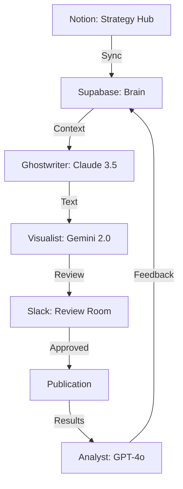

# ICOS (Infinity Content OS) 🤖

The **Infinity Content OS (ICOS)** is an autonomous **Decentralized Intelligence Engine** designed to scale personal brands through structured feedback loops, artifacts, and high-fidelity RAG systems.

---

## 🎯 Core Capabilities

### 1. The Research Engine 🔍
* **Autonomous Scraping**: Daily web scraping of industry news and trends.
* **Strategic Filtering**: Matches incoming data against Brand pillars in Notion.

### 2. The Ghostwriter ✍️
* **Claude 3.5 Powered**: Generates content aligned with "Justin Welsh" writing principles.
* **Voice Fine-Tuning**: Uses a RAG system (Supabase) to maintain consistent tone and style.

### 3. The Impact Loop 📈
* **Automated Audits**: Analyzes post performance and identifies why content succeeded or failed.
* **Self-Optimization**: Automatically updates voice profiles based on engagement data.

### 4. Bilingual Omni-channel 🌍
* **English & Spanish**: Generates weekly long-form newsletters in both languages.

---

## 🏗️ Intelligence Architecture

---

## 🚀 Tech Stack
- **LLMs**: Anthropic Claude 3.5, Google Gemini 2.0, GPT-4o
- **Vector DB**: Supabase (pgvector)
- **Orchestration**: n8n, Python
- **Integrations**: Notion, Slack, Buffer, Taplio

---
**Developed by Wadi Bardawil** - Transforming operational overwhelm into strategic clarity.
